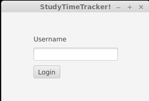
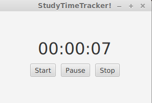

# StudyTimeTracker

Ohjelmointitekniikat kurssin harjoitustyö

Opiskelun ajankäytön seurantasovellus.

## Dokumentaatio

[Alustava määrittelydokumentti](./dokumentaatio/vaatimusmaarittelu.md)

[Tuntikirjanpito sovellukseen tekemiseen käytetystä ajasta](./dokumentaatio/tuntikirjanpito.md)

[Arkkitehtuurikuvaus](./dokumentaatio/arkkitehtuuri.md)

## Kehitysvaiheen toiminnallisuudet (päivitetty 24.11.2019)

Ohjelman voi käynnistää esim. komennolla (HUOM! Käyttöliittymä on vielä tässä vaiheessa erittäin keskeneräisessä vaiheessa)

```
mvn compile exec:java -Dexec.mainClass=studytimetracker.ui.StudyTimeTrackerUi
```

Valikosta voi valita toiminnallisuuden seuraavasti

"1" == Kirjaudu (Järjestelmään voi kirjautua tunnuksella 'test').

"2" == Luo uusi tunnus ('test' on jo varattu, joten sitä ei voi käyttää)

"3" == Käynnistä primitiivinen gui käyttöliittymä, jossa voi tällä hetkellä "kirjautua" ja käynnistää sekunttikellon ajanseurantaa varten:




